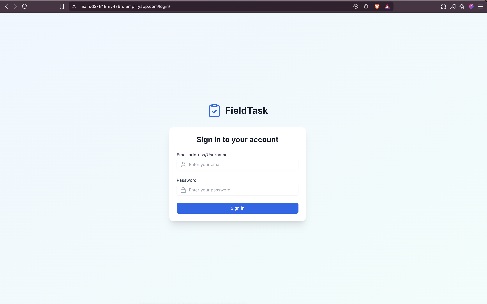
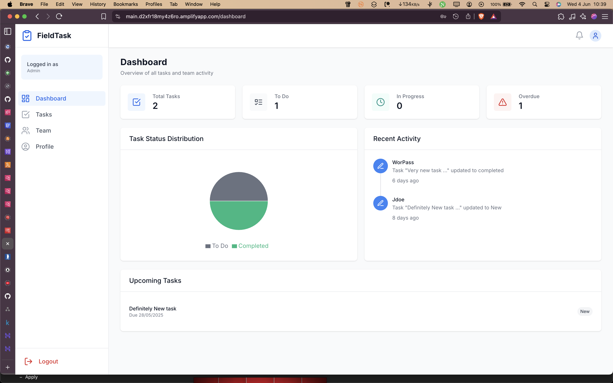
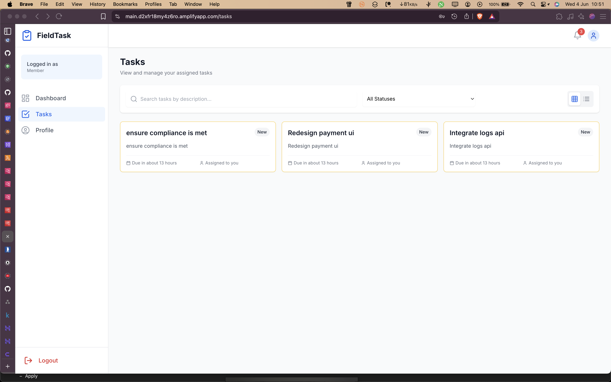
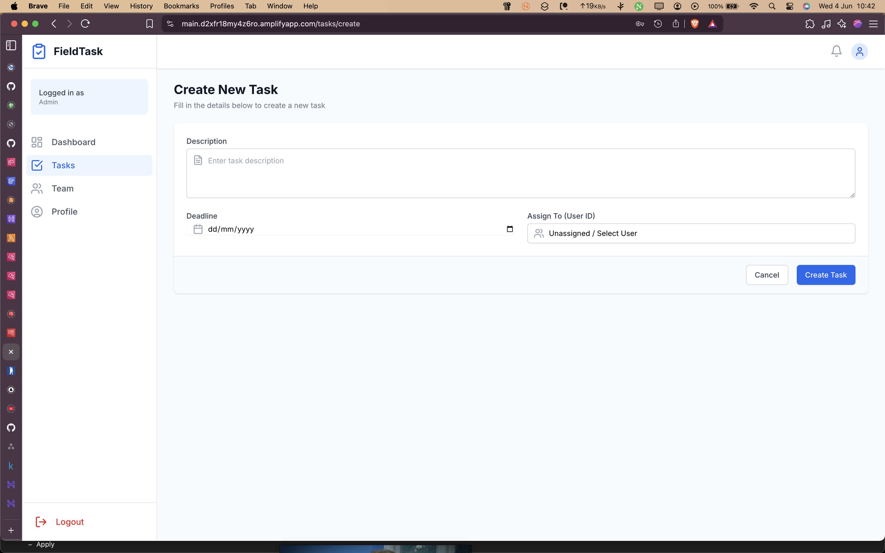
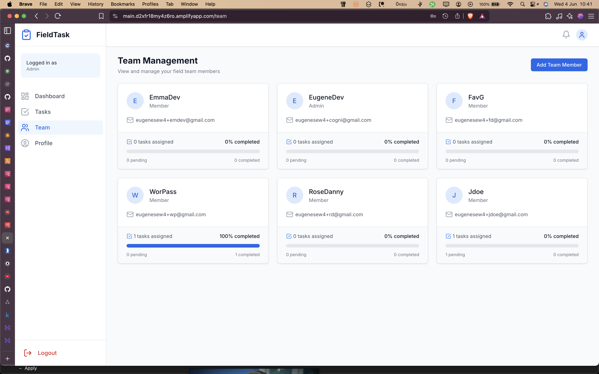

# FieldTask - Frontend

This is the _completed_ frontend application for FieldTask, a robust task management system designed for field teams and administrative staff.
It provides comprehensive features for task creation, assignment, status tracking, and team overview, fulfilling all requirements of the Holiday Task lab.

**Live Application URL:** [https://main.d1wbbnjgdrig4e.amplifyapp.com/](https://main.d1wbbnjgdrig4e.amplifyapp.com/)

## Testing the Live Application

To test the application functionalities, you can:

1.  Log in with the provided default admin credentials:
    - **Username:** `sandb-admin`
    - **Password:** `@y3h2CuonH`
2.  As an admin, navigate to the Team Management section.
3.  Add a new team member and then try logging in with the new member's credentials to test the member's view and task functionalities.

## Table of Contents

- [Features](#features)
- [Tech Stack](#tech-stack)
- [Project Structure](#project-structure)
- [Architectural Overview (AWS Serverless)](#architectural-overview-aws-serverless)
- [Prerequisites](#prerequisites)
- [Environment Variables](#environment-variables)
- [Setup and Installation](#setup-and-installation)
- [Running the Application](#running-the-application)
- [Building for Production](#building-for-production)
- [Linting and Formatting](#linting-and-formatting)
- [Key Architectural Decisions](#key-architectural-decisions)
- [Screenshots](#screenshots)

## Features

- **User Authentication**: Secure login for users (admins and members) using AWS Cognito.
- **Role-Based Access Control**:
  - Admins: Can create tasks, assign tasks, view all tasks, manage team members, and view overall dashboard statistics.
  - Members: Can view tasks assigned to them, update the status of their tasks, and view their personalized dashboard.
- **Task Management**:
  - Create, view, update (status), and delete (admin-only) tasks.
  - Assign tasks to team members.
  - Set deadlines for tasks.
  - Track task status: New, In Progress, Completed.
- **Dashboard**:
  - Overview of task statistics (Total, To Do, In Progress, Overdue).
  - Pie chart visualizing task status distribution.
  - Recent activity feed based on task creations and updates.
  - List of upcoming tasks.
- **Team Overview (Admin-only)**: View team members and their task statistics.
- **Notifications**: In-app notifications for events like task assignment or status updates (conceptual, store exists).
- **Responsive UI**: Designed to work on various screen sizes.

## Tech Stack

- **React**: JavaScript library for building user interfaces.
- **Vite**: Fast frontend build tool.
- **TypeScript**: Superset of JavaScript that adds static typing.
- **Zustand**: Small, fast, and scalable bearbones state-management solution.
- **React Router DOM**: For client-side routing.
- **Tailwind CSS**: Utility-first CSS framework for rapid UI development.
- **Recharts**: Composable charting library for data visualization.
- **Lucide React**: Library of simply beautiful open-source icons.
- **AWS Cognito**: For user authentication (via `amazon-cognito-identity-js`).
- **ESLint**: For linting TypeScript/JavaScript code.
- **Date-fns**: For date formatting and manipulation.

## Project Structure

```
frontend/
├── public/                 # Static assets
├── src/
│   ├── components/         # Reusable UI components
│   │   ├── auth/           # Auth-related components (ProtectedRoute)
│   │   ├── dashboard/      # Dashboard specific components (StatCard, TasksChart, RecentActivity)
│   │   ├── navigation/     # Navigation elements (Header, Sidebar, MobileSidebar)
│   │   ├── notifications/  # Notification panel
│   │   ├── tasks/          # Task-related components (TaskCard, TaskForm)
│   │   ├── team/           # Team-related components (TeamMemberCard)
│   │   └── ui/             # Generic UI elements (Button, Card, Input, Loading)
│   ├── data/               # Mock data (if any, currently minimal)
│   ├── layouts/            # Layout components (AuthLayout, DashboardLayout)
│   ├── pages/              # Page components mapped to routes
│   │   ├── auth/           # Login page
│   │   ├── dashboard/      # Dashboard page
│   │   ├── profile/        # Profile page (placeholder)
│   │   ├── tasks/          # Task list, task details, create task pages
│   │   └── team/           # Team management page
│   ├── stores/             # Zustand state management stores (auth, tasks, team, notifications)
│   ├── types/              # TypeScript type definitions (User, Task, Notification, etc.)
│   ├── App.tsx             # Main application component, sets up routing
│   ├── main.tsx            # Entry point of the application
│   └── index.css           # Global styles and Tailwind directives
├── .env.example          # Example environment variables file
├── .gitignore
├── eslint.config.js        # ESLint configuration
├── index.html              # Main HTML file
├── package.json
├── postcss.config.js       # PostCSS configuration (for Tailwind)
├── tailwind.config.js      # Tailwind CSS configuration
├── tsconfig.json           # TypeScript compiler options
├── tsconfig.app.json       # TypeScript compiler options for the app
├── tsconfig.node.json      # TypeScript compiler options for Node.js context (e.g. Vite config)
└── vite.config.ts          # Vite configuration
```

## Architectural Overview (AWS Serverless)

This application is built with a serverless-first approach on AWS, leveraging managed services for scalability, reliability, and reduced operational overhead.

For the backend infrastructure code, please refer to the [AWS CDK Backend Repository](https://github.com/eugene-sew/gtp_holiday_cdk).


**Key AWS Services Used:**

1.  **AWS Amplify Hosting**:

    - **Purpose**: Hosts the static React frontend application (HTML, CSS, JS assets generated by `npm run build`).
    - **Features**: Provides a Git-based CI/CD workflow for continuous deployment, global content delivery network (CDN), custom domain support, and SSL/TLS certificates.
    - **Live URL**: [https://main.d2xfr18my4z6ro.amplifyapp.com/](https://main.d2xfr18my4z6ro.amplifyapp.com/)

2.  **AWS Cognito**:

    - **Purpose**: Manages user authentication and authorization.
    - **Features**: Handles user sign-up, sign-in, password policies, multi-factor authentication (MFA), and issues JWT (JSON Web Tokens) for session management. User roles (e.g., `admin`, `member`) are managed via Cognito Groups, which are included in the ID token.

3.  **AWS API Gateway**:

    - **Purpose**: Acts as the front door for the backend API.
    - **Features**: Manages HTTP(S) endpoints (e.g., `/tasks`, `/users`), request/response transformations, request validation, authorization (often integrated with Cognito authorizers), throttling, and caching.

4.  **AWS Lambda**:

    - **Purpose**: Provides the serverless compute for the backend API logic.
    - **Features**: Executes code in response to API Gateway requests. Each API endpoint or a group of related endpoints typically maps to a Lambda function. These functions handle business logic such as:
      - CRUD (Create, Read, Update, Delete) operations for tasks.
      - Fetching and managing user/team data (listing users, potentially updating user-related info not in Cognito).
      - Interaction with the database.

5.  **AWS DynamoDB (or other managed database - Presumed)**:
    - **Purpose**: Persistent storage for application data.
    - **Features**: While not explicitly detailed from the frontend code, a serverless backend like this commonly uses DynamoDB (a NoSQL, key-value, and document database) for its scalability, performance, and pay-per-use model. Other options include Amazon RDS or Aurora Serverless.
    - **Data**: Stores task details, potentially extended user profiles, and other application-specific data.

**Data Flow Example (Fetching Tasks):**

1.  User logs in via the React app, which communicates with AWS Cognito.
2.  Cognito authenticates the user and returns JWTs (ID token, access token).
3.  The React app stores the ID token (e.g., in `authStore`).
4.  When the user navigates to the tasks page, the `taskStore` initiates a fetch request.
5.  The request, including the ID token in the `Authorization` header, is sent to AWS API Gateway.
6.  API Gateway validates the token (potentially using a Cognito authorizer) and routes the request to the appropriate AWS Lambda function for fetching tasks.
7.  The Lambda function queries the database (e.g., DynamoDB) for tasks, performs any necessary logic (like filtering based on user roles if applicable at the backend), and returns the data.
8.  API Gateway sends the response back to the React application.
9.  The `taskStore` updates its state, and the UI re-renders to display the tasks.

This serverless architecture allows the application to scale automatically based on demand and reduces the need to manage underlying server infrastructure.

## Prerequisites

- Node.js (v18.x or later recommended)
- npm (usually comes with Node.js)

## Environment Variables

The application requires certain environment variables to connect to the AWS Cognito backend and the Task API. Create a `.env` file in the `frontend` directory by copying `.env.example` (if it exists, otherwise create it from scratch) and fill in the necessary values:

```env
VITE_APP_AUTH_USER_POOL_ID=<Your_Cognito_User_Pool_ID>
VITE_APP_AUTH_USER_POOL_WEB_CLIENT_ID=<Your_Cognito_User_Pool_Web_Client_ID>
VITE_APP_API_BASE_URL=<Your_Task_API_Base_URL>
```

- `VITE_APP_AUTH_USER_POOL_ID`: Your AWS Cognito User Pool ID.
- `VITE_APP_AUTH_USER_POOL_WEB_CLIENT_ID`: Your AWS Cognito User Pool Web Client ID.
- `VITE_APP_API_BASE_URL`: The base URL for your backend API that serves task and user data (e.g., `https://api.example.com/dev/`).

## Setup and Installation

1.  **Clone the repository** (if you haven't already):

    ```bash
    git clone https://github.com/eugene-sew/gtp_holiday_field_app.git
    cd gtp_holiday_field_app/
    ```

2.  **Install dependencies**:

    ```bash
    npm install
    ```

3.  **Set up environment variables**:
    Create a `.env` file in the directory as described in the [Environment Variables](#environment-variables) section.

## Running the Application

To start the development server:

```bash
npm run dev
```

This will typically start the application on `http://localhost:5173` (or another port if 5173 is busy). The server supports Hot Module Replacement (HMR).

## Building for Production

To create a production build of the application:

```bash
npm run build
```

The optimized static assets will be placed in the `dist` directory. These files can then be deployed to any static hosting service.

## Linting and Formatting

To lint the codebase using ESLint:

```bash
npm run lint
```

## Key Architectural Decisions

- **State Management (Zustand)**: Chosen for its simplicity, minimal boilerplate, and good performance. Stores are modularized (auth, tasks, team, notifications) for better organization.
- **API Interaction**: Centralized within Zustand stores. Stores handle fetching data, managing loading/error states, and providing actions for CRUD operations. This keeps components cleaner and focused on presentation.
- **Authentication (AWS Cognito)**: Uses the `amazon-cognito-identity-js` library to interact with AWS Cognito for user sign-up, sign-in, and session management. The `authStore` abstracts Cognito interactions.
- **Routing (React Router DOM)**: Standard library for client-side routing in React applications. `ProtectedRoute` component handles route protection based on authentication status and user roles.
- **Styling (Tailwind CSS)**: Utility-first CSS framework allowing for rapid development and consistent styling. Configured with PostCSS.
- **Type Safety (TypeScript)**: Used throughout the project to improve code quality, maintainability, and reduce runtime errors.
- **Component-Based Architecture**: Application is structured into reusable components, pages, and layouts for better organization and maintainability.
- **Optimistic Updates**: Some store actions (e.g., task updates, deletions) update the local state immediately before the API call completes. This provides a faster user experience. Error handling should ideally revert optimistic updates if an API call fails (partially implemented).
- **Environment Variables**: Configuration like API endpoints and Cognito IDs are managed through `.env` files, keeping sensitive information out of the codebase.
- **Data Transformation**:
  - User data from the team API (`/users`) is transformed from `ApiUser` to the local `User` type in `teamStore.ts`.
  - Recent activity on the dashboard is dynamically generated from task data in `Dashboard.tsx` rather than relying on a separate activity store.

## Screenshots

### Login Page



### Dashboard (Admin View)



### Tasks Page (Member View)



### Create Task Form



### Team Overview (Admin View)


